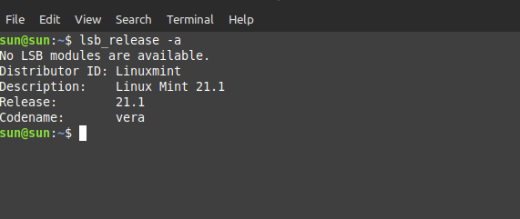
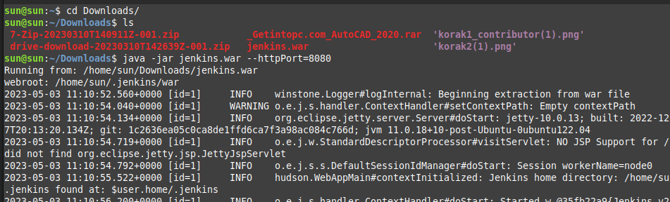
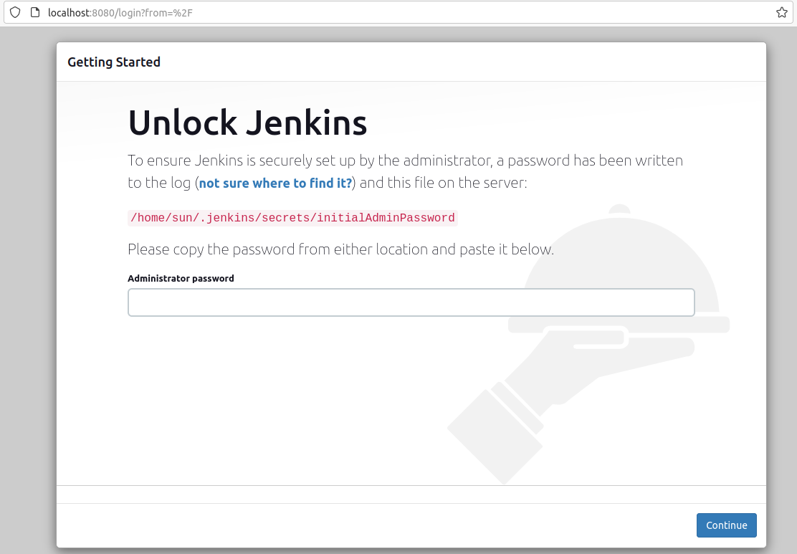
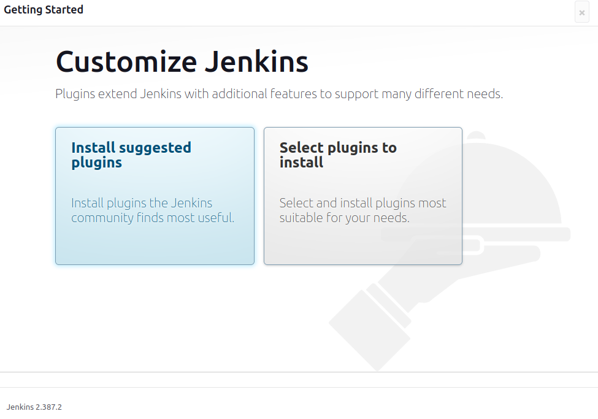
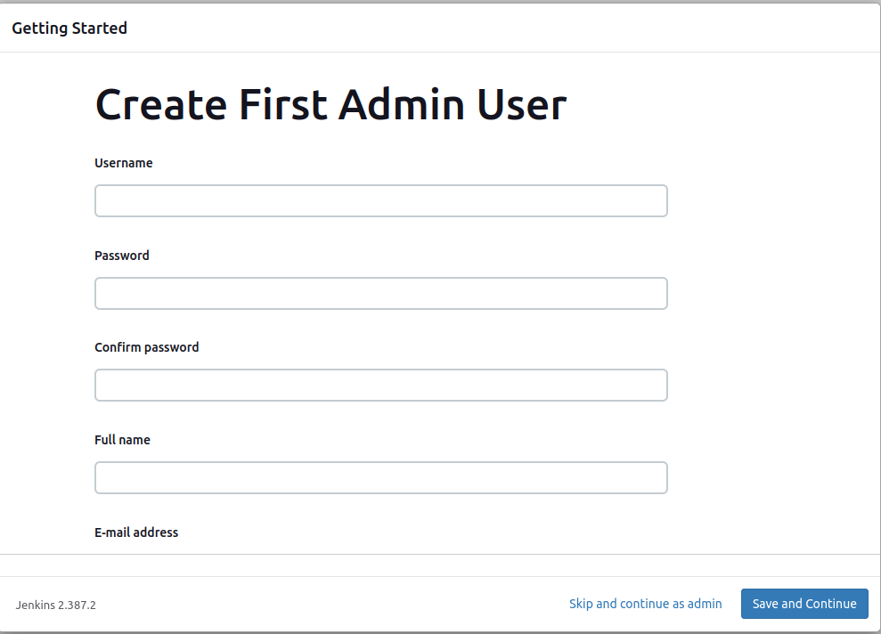
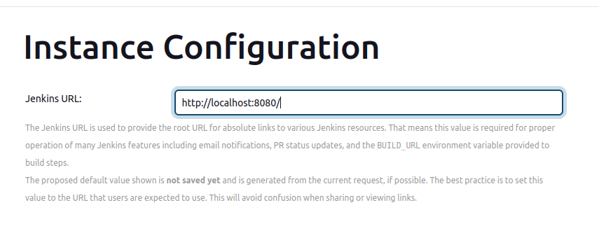
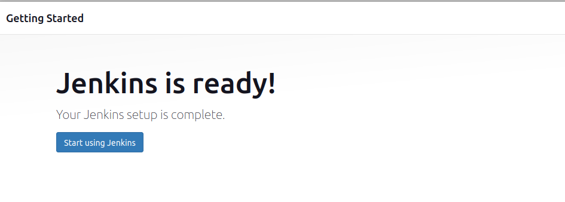
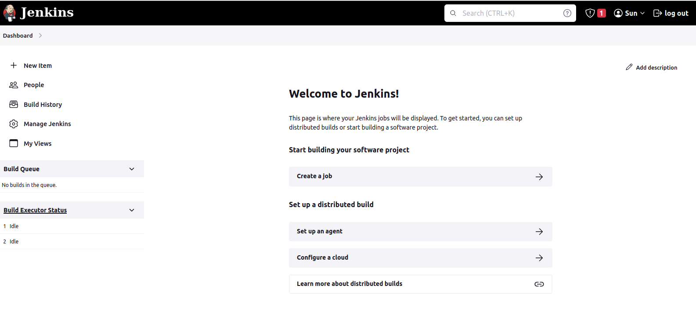

## Napomena: ostaviti 1,2,3 korak a ostale uraditi kao za english bez war fajla

1. Provjera verzije sistema

        $lsb_release -a

    

2. Provjera da li imamo instaliranu Javu i provjera verzije

        $ sudo apt update
        $java -version

    Ukoliko nemate instalirajte pomocu komande: 

        $ sudo apt install openjdk-11-jre
        $ java -version

3. Download WAR fajla sa official stranice Jenkins: [www.jenkins.io](https://www.jenkins.io/download/)

4. U terminalu pokrenuti komandu
        
        $cd Downloads
        $java -jar jenkins.war --httpPort=8080

    Napomena: Nemojte zatvarati ovaj terminal, 
    na kraju se prikaze password koji trebate kopirati i unijeti u sljedecem koraku

    

5. Pokrenuti browser i unijeti: 

        http://localhost:8080/login

    Kopirajte password s terminala koji je u obliku: 349192401djsd22312dwfsdwr5

    

6. Browser: Customize Jenkins 

    Potrebno je instalirati plugins za Jenkins, potrebno je izabrati "Suggested plugins"

    

7. Postavljanje initial korisnika, koji ce biti po defaultu root

    

8. Konfiguracija instance (po defaultu vecinom se ostavi, ali se moze naknadno promijeniti)

    

9. Zavrsena instalacija Jenkins
    
    

10. GUI Jenkinsa (pocetna stranica nakon pokretanja Jenkinsa)
    
    

11. Restart Jenkins, ako se ne restarta onda Refresh stranice manuelno

Ukoliko budete imali problema prilikom sljedeceg logina na Jenkins,provjerite:

1. Firewall da li dopusta port 8080 za Jenkins: 

    $sudo ufw enable

2. Provjerite status firewall-a:

    $sudo ufw status 

    Prikazat ce da je Status:active i ALLOW

3. Dopustanje portu 8080 za pristup 

    $sudo ufw allow 8080

4. Restart Jenkins i provjeriti status: 
    
    $service jenkins restart
    $systemctl status jenkins 

Ukoliko i nakon ovoga budete imali problema, u terminalu probajte pokrenuti ponovo komandu: 

    $cd Downloads    // gdje se nalazi war file
    $java -jar jenkins.war --httpPort=8080

Nakon ove komande unesite u browser: http://localhost:8080, gdje ce se prikazati Jenkins GUI. 

