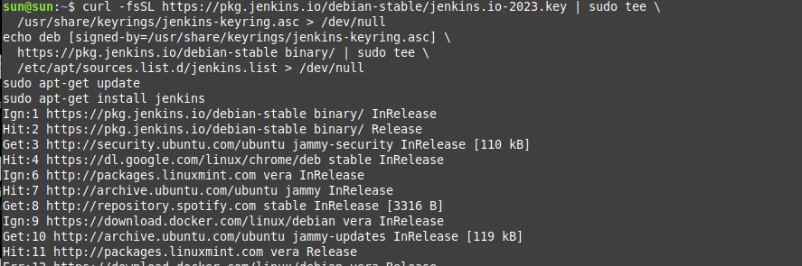
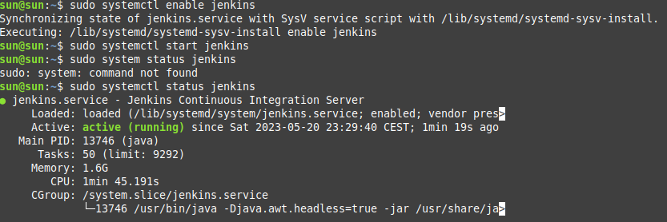
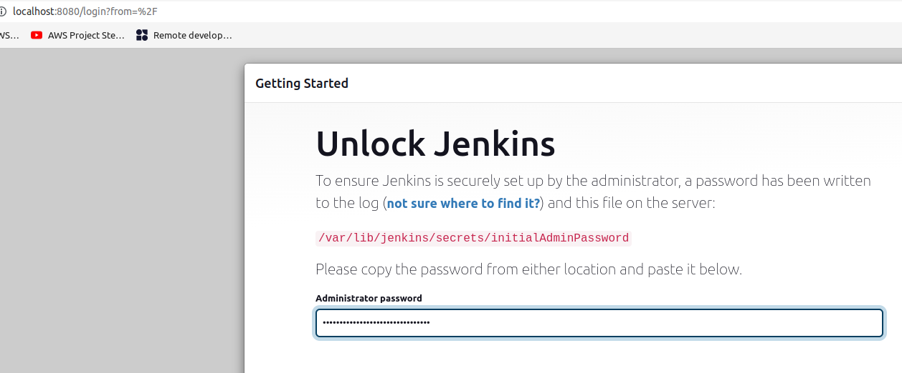
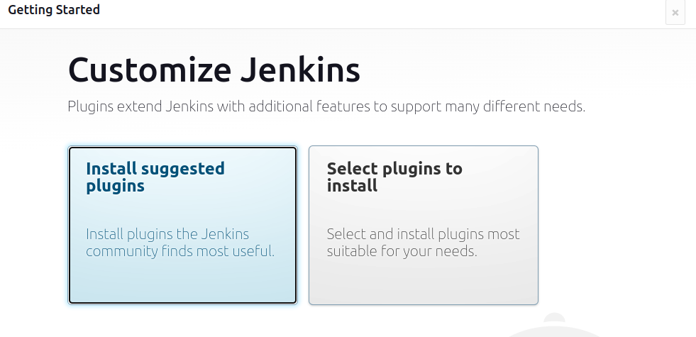
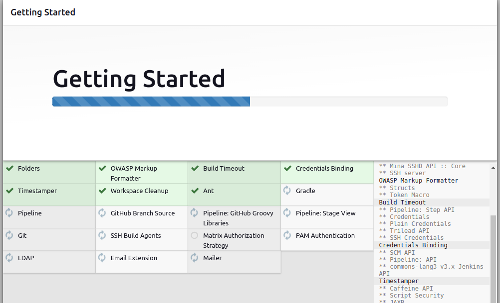
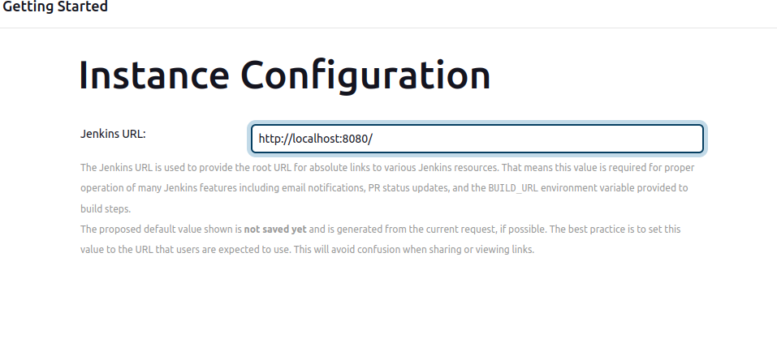
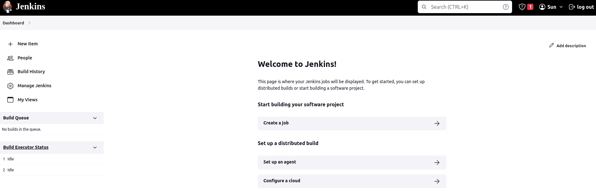

### If you have different version of Linux you can check on this site commands: 
[Jenkins.io](https://www.jenkins.io/doc/book/installing/linux/)

1. For Debian/Ubuntu (local-CLI)

        curl -fsSL https://pkg.jenkins.io/debian-stable/jenkins.io-2023.key | sudo tee \
        /usr/share/keyrings/jenkins-keyring.asc > /dev/null
        echo deb [signed-by=/usr/share/keyrings/jenkins-keyring.asc] \
        https://pkg.jenkins.io/debian-stable binary/ | sudo tee \
        /etc/apt/sources.list.d/jenkins.list > /dev/null
        sudo apt-get update
        sudo apt-get install jenkins

2. Start jenkins

You can enable the Jenkins service to start at boot with the command:

        sudo systemctl enable jenkins

You can start the Jenkins service with the command:

        sudo systemctl start jenkins

You can check the status of the Jenkins service using the command:

        sudo systemctl status jenkins

3. Go to your browser and check on the page: http://localhost:8080 (it's usually on port 8080)

4. In browser copy password from CLI prompt

        sudo cat /var/lib/jenkins/secrets/initialAdminPassword

    

5. Insert this pass in your Admin password place (step3)
   
6. Install plugins suggested
   
   

   

7. Insert admin user and password (remember)

8. Instance configuration

    

9. Welcome page
    
    Restart Jenkins (refresh page) or LogOut then again login on Jenkins

    